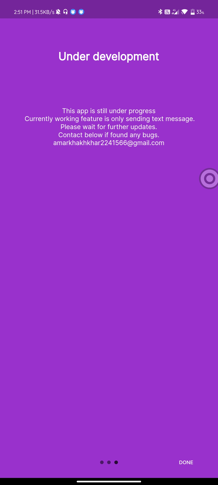
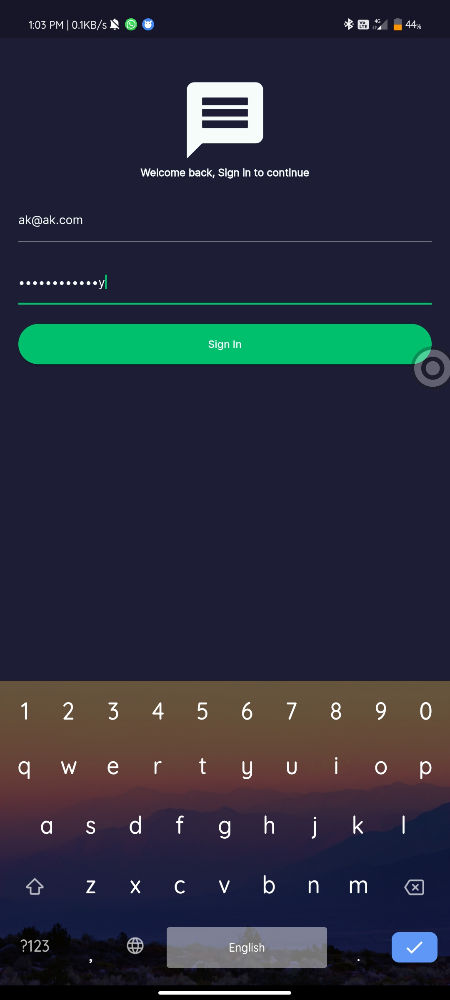
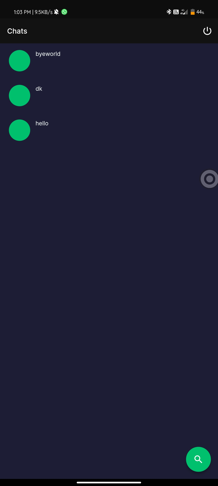
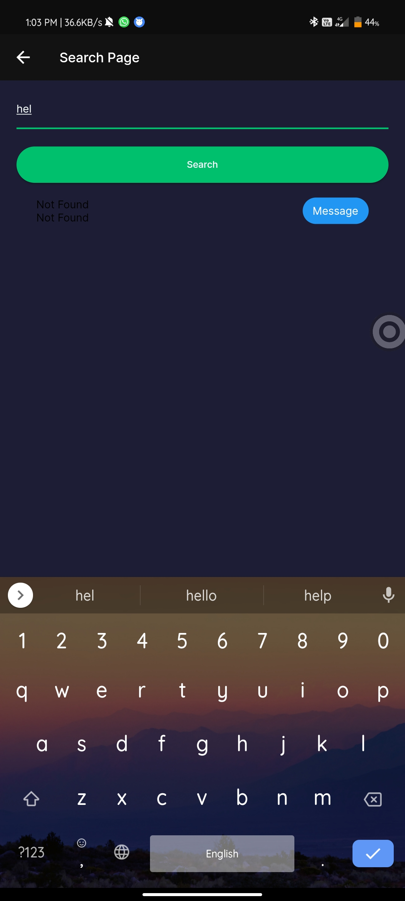
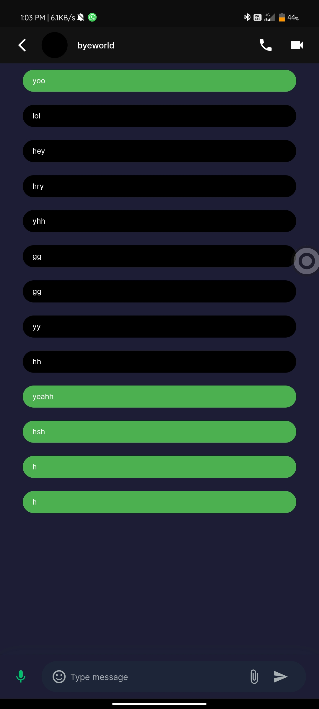

# chat_app
 A pretty basic chat app for one on one chatting, currently only supporting texting features
<h1>Screenshots of App</h1>
<h3>Intro Page</h3>

 <h3>SignIn/SignUp option</h3>
 
 <h3>Sign In Page</h3>
 
 <h3>Main Page</h3>\
 
 <h3>New chat search page</h3>
 <h3>Username Found and Not Found page</h3>
 
 
 <h3>Chat Screen</h3>
 
